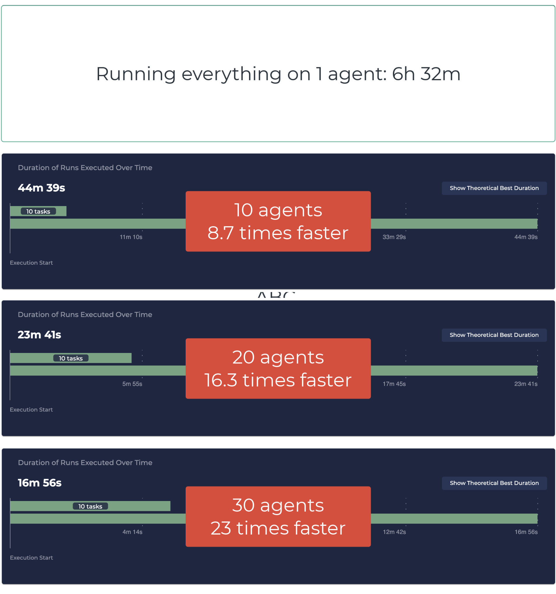
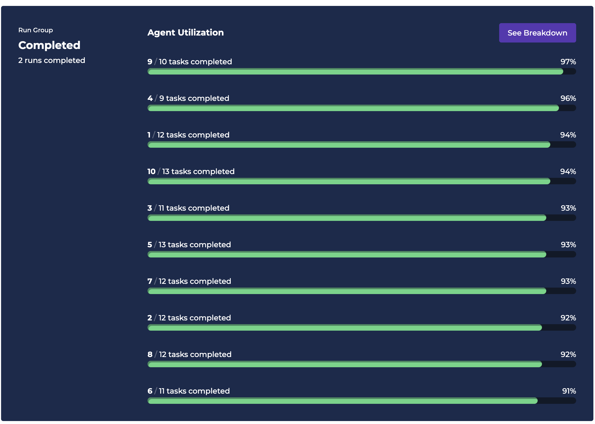
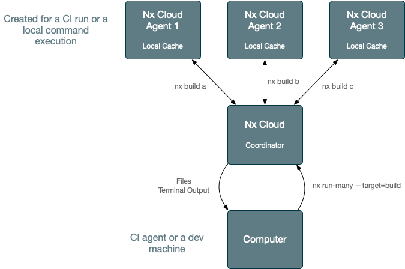
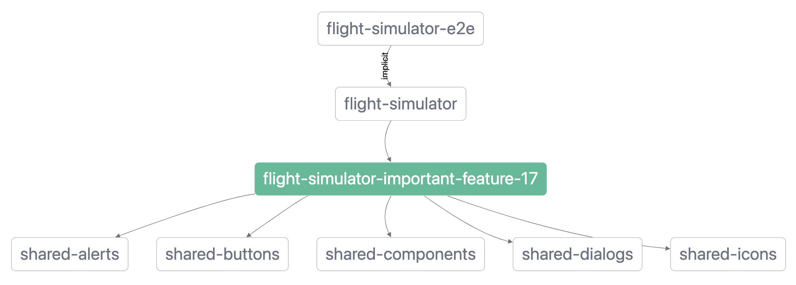

# Lerna Distributed Task Execution (DTE) Example/Benchmark

#### On how to make your CI 23 times faster with a small config change


New versions of Lerna can use Nx (powerful build system) to execute tasks. This means that Lerna now supports
configuration-free distributed task execution (via Nx and Nx Cloud)--you can execute any `lerna run` command across as
many machines while preserving the dev ergonomics of running it on a single machine.

This repo illustrates how this works, and what performance benefits you get from it.

> Since Lerna uses Nx to run tasks, in the context of running tasks, the words "Lerna" and "Nx" are interchangeable. If
> I say Lerna can do something, it means Nx can do it, and vise versa.

## Repo Contains

* 5 shared buildable packages/libraries with 250 components each
* 5 Next.js applications built out of 20 app-specific libraries. Each app-specific lib has 250 components each. Each
  library uses the shared components.

## Results



Running all the builds and tests in this repo on 1 machine takes about ~6h 30m, which is obviously unusable, so
to make such a repo work, you have to distribute.

This repo enables Distributed Task Execution using Nx Cloud, which means that `lerna run` commands would run on multiple
agents. It doesn't require us to change how our CI configuration is written or how our commands are executed. Enabling
DTE and setting the number of agents is a small config change.

> Nx Cloud is free for all OSS projects and for most closed-source projects

The repo shows what happens when we use a different number of agents per CI run. It's 8.7 times faster with 10 agents,
and 23 times faster with 30 agents. You can allocate even more agents and reduce the CI time to about 7 minutes.

Note the dev ergonomics remained the same:

* All build artifacts end up on the main agent
* All logs are in one place
* **The dev ergonomics of using 30 agents is exactly the same as using a single agent.**
* Changing the number of agents is a 1-line PR.

### Intelligent Distribution

Nx Cloud (used by Lerna here) knows what commands your CI is running. It also knows how many agents you typically use,
and how long each task in your workspace typically takes. Nx Cloud uses this information to create an execution
plan. For instance, it knows that tests do not depend on each other, whereas we need to build the shared libraries
first. Nx knows that the theoretical limit of how fast your CI can get
is `slowest build of shared lib + slowest build of app`, so it will prioritize building shared libs to unblock the apps.

This results in a somewhat even utilisation:
<br>

<br>

After you run your CI a couple of times, Nx Cloud (used by Lerna) will learn stats about your workspace, and your CI
will be more or less as fast as it can be given the provided agents. If you change the number of agents, it will
rebalance the work. As you keep changing your repo, Nx Cloud will keep its understanding of it up to date and will keep
your CI fast.

**This all happens without you having to do anything.**

### What About Remote Caching?

Lerna supports remote computation caching, but it doesn't help this particular case. Remote caching ONLY helps with the
average case, where some tasks are cached and some are not. In the worst case scenario nothing is cached. The only way
to make the worst case scenario fast is to distribute. **And you have to distribute.** If you average CI time is 10
mins, but your worst case CI time (which say happens every couple of days) is 6 hours, it is still unusable.

## Understanding Two Approaches to Distribution

**Non-trivial repos always use more than one agent in CI to verify PRs. The bigger the repo is, the more agents you
use (our clients’ biggest repos use 100+ agents for every CI run).**

There are two ways to distribute work across agents: **Sharding/Binning** and **Distributed Task Execution**

### Approach 1: Sharding/Binning

Binning is an approach to distribution where the planning job divides the work into equally-weighted bins, one for each
worker job. Then every worker executes the work prepared for it. After that the post-verification job runs. This
requires you to completely change your CI setup.

### Approach 2: Distributed Task Execution

Distributed Task Execution is an approach where any command can be distributed and run on N machines instead of a single
machine without changing the dev ergonomics or other assumptions about that command. This doesn't require you to change
your CI setup.

<br>

<br>

Sharding/binning works for smaller repos (up to 10 agents), but even at that scale it has a lot of problems:

- Agent utilization is uneven, so the CI is slower. And it requires manual rebalancing of tasks between agents.
- Bad dev ergonomics (e.g., 10 different logs with potential failures).
- It doesn't work for builds.

### Sharding Doesn't Work for Builds?

The CI has to build shared libraries first because Next.js applications consume those libraries
from "dist".



You cannot shard non-flat graphs, so you would have to rebuild shared libraries on all agents (which would make your CI
much slower). If most of your libraries are buildable, it won’t work at all.

[Read more about binning/sharding and
DTE](https://blog.nrwl.io/distributing-ci-binning-and-distributed-task-execution-632fe31a8953).

### Could We Use Binning/Sharding?

If we were to change the repo to use binning/sharding, we would end up with:

* 500-line complex CI config
* Uneven utilization (so the CI time would be slower given the same number of agents)
* Bad DX (we would see 30 different commands instead of 4 we logically have). Even with 30 agents, the sharding setup is
  not really usable.

## Why No Other Build System Uses DTE?

Given everything mentioned, using distributed task execution is clearly much better. So why only Lerna and Nx support
it, whereas so many tools support remote caching?

Remote caching is relatively easy to build (took me about 3 days to get the first working version up and running), and
distributed task execution is hard (took us about a year), but the payoff is huge.

And there are several build systems supporting DTE. For instance, Bazel and Buck support DTE. They are used at Google
and Facebook and some form of DTE is the only way to scale large repo. I have a lot of respect for the teams working on
them but, if I’m honest, they don’t work well for the JS ecosystem.

To be honest, a lot of Nx (and Lerna) work is taking cool ideas developed by those talented teams and making them super
easy to use.

## Enabling DTE

In the current setup any lerna run command is distributable using Nx Cloud. It doesn't matter whether you build, test or
lint, whether you use GitHub Actions or Jenkins. It works everywhere.

The easiest way to enable it is by using the GitHub Actions workflow (this is what this repo does).

```yaml
name: CI

on:
  push:
    branches:
      - main
  pull_request:

jobs:
  main:
    name: Main Job
    uses: nrwl/ci/.github/workflows/nx-cloud-main.yml@v0.4
    with:
      parallel-commands-on-agents: |
        npx lerna run test
        npx lerna run build

  agents:
    name: Cloud - Agents
    uses: nrwl/ci/.github/workflows/nx-cloud-agents.yml@v0.4
    with:
      number-of-agents: 30
```

But the workflow is just syntactic sugar which can be extended into something like this:

```yaml
name: LargeRepo

on:
  push:
    branches:
      - main
  pull_request:

env:
  NX_CLOUD_DISTRIBUTED_EXECUTION: 'true'

jobs:
  agents:
    name: Nx Cloud Agents
    runs-on: ubuntu-latest
    timeout-minutes: 60
    strategy:
      matrix:
        agent: [1, 2, 3, 4, 5, 6, 7, 8, 9, 10, 11, 12, 13, 14, 15, 16, 17, 18, 19, 20]
    steps:
      - uses: actions/checkout@v2
      - uses: actions/setup-node@v1
      - run: npm install
      - name: Start Nx Agent ${{ matrix.agent }}
        run: npx nx-cloud start-agent

  main:
    runs-on: ubuntu-latest
    steps:
      - uses: actions/checkout@v2
      - uses: actions/setup-node@v1
      - run: npm install
      - name: Run verification
        uses: JamesHenry/parallel-bash-commands@v0.1
        with:
          cmd1: npx lerna run test
          cmd2: npx lerna run build
      - run: npx nx-cloud stop-all-agents
```

You can find all the examples of setting it up [here](https://nx.dev/using-nx/ci-overview). There are guides for all
major CI providers. Simply replace any "nx affected" command with "lerna run"--the rest will work the same way.

